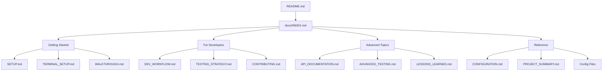

# Documentation Architecture and Standards

**Project**: The Hack: Ghost Protocol
**Purpose**: Define documentation structure, standards, and maintenance processes
**Last Updated**: October 24, 2025
**Maintainer**: Project Team

---

## 📋 Overview

This document establishes the architecture, standards, and maintenance processes for The Hack: Ghost Protocol documentation ecosystem. It serves as a guide for contributors and maintainers to ensure consistent, high-quality, and maintainable documentation.

**Goals**:

-   **Consistency**: Uniform structure and style across all documentation
-   **Accessibility**: Clear navigation for all user types and skill levels
-   **Maintainability**: Sustainable update processes and quality assurance
-   **Completeness**: Comprehensive coverage of all project aspects
-   **Usability**: Easy discovery and consumption of information

---

## 🏗️ Documentation Architecture

### Hierarchical Structure

The documentation follows a three-tier architecture designed for progressive disclosure and role-based access:

#### Tier 1: Entry Points

**Purpose**: First contact and orientation
**Audience**: All users
**Files**:

-   **README.md** - Primary project overview and quick start
-   **docs/INDEX.md** - Master navigation hub and comprehensive guide
-   **CONTRIBUTING.md** - Contributor onboarding and guidelines

#### Tier 2: Domain-Specific Guides

**Purpose**: Detailed information for specific use cases
**Audience**: Targeted user groups
**Categories**:

-   **User Guides**: WALKTHROUGH.md, DEMO.md, TERMINAL_SETUP.md
-   **Developer Guides**: SETUP.md, DEV_WORKFLOW.md, TESTING_STRATEGY.md
-   **Contributor Guides**: CHALLENGE_DESIGN_GUIDE.md, API_DOCUMENTATION.md
-   **Reference Guides**: CONFIGURATION.md, PROJECT_SUMMARY.md

#### Tier 3: Specialized Documentation

**Purpose**: Deep technical details and specialized knowledge
**Audience**: Expert users and maintainers
**Categories**:

-   **Architecture**: IMPLEMENTATION_SUMMARY.md, LESSONS_LEARNED.md
-   **Advanced Topics**: ADVANCED_TESTING.md, CI_CD_PIPELINE.md
-   **Maintenance**: DEVELOPER_TROUBLESHOOTING.md, Security documentation

### Information Flow Design



---

## 📚 Documentation Categories

### By Audience

#### Players and End Users

**Characteristics**: Want to use the software quickly and effectively
**Information Needs**: Installation, basic usage, troubleshooting
**Documentation Style**: Step-by-step, visual aids, minimal technical jargon

**Primary Documents**:

-   **README.md** - Project overview and installation
-   **WALKTHROUGH.md** - Complete gameplay guide with solutions
-   **DEMO.md** - Visual demonstration of features
-   **TERMINAL_SETUP.md** - Environment optimization

**Quality Criteria**:

-   Clear installation instructions for all platforms
-   Visual examples and screenshots where helpful
-   Troubleshooting for common issues
-   Minimal technical prerequisites assumed

#### Contributors and Content Creators

**Characteristics**: Want to add content or improve the project
**Information Needs**: Contribution process, design guidelines, standards
**Documentation Style**: Detailed processes, examples, best practices

**Primary Documents**:

-   **CONTRIBUTING.md** - Complete contribution guidelines
-   **CHALLENGE_DESIGN_GUIDE.md** - Educational content creation
-   **ROADMAP.md** - Future direction and opportunities
-   **GitHub Templates** - Issue and PR templates

**Quality Criteria**:

-   Clear contribution workflows
-   Comprehensive design guidelines
-   Examples of good contributions
-   Quality standards and review processes

#### Developers and Technical Contributors

**Characteristics**: Want to modify, extend, or maintain the codebase
**Information Needs**: Architecture, APIs, development setup, testing
**Documentation Style**: Technical precision, code examples, architectural diagrams

**Primary Documents**:

-   **SETUP.md** - Development environment configuration
-   **DEV_WORKFLOW.md** - Daily development processes
-   **API_DOCUMENTATION.md** - Complete API reference
-   **TESTING_STRATEGY.md** - Quality assurance processes

**Quality Criteria**:

-   Accurate technical information
-   Complete API documentation with examples
-   Reproducible setup instructions
-   Comprehensive testing guidance

#### Maintainers and Project Leaders

**Characteristics**: Responsible for project direction and long-term health
**Information Needs**: Architecture decisions, lessons learned, strategic direction
**Documentation Style**: High-level analysis, decision rationale, strategic planning

**Primary Documents**:

-   **PROJECT_SUMMARY.md** - Technical achievements overview
-   **LESSONS_LEARNED.md** - Development insights and best practices
-   **CI_CD_PIPELINE.md** - Infrastructure and automation
-   **IMPLEMENTATION_SUMMARY.md** - Complete feature catalog

**Quality Criteria**:

-   Strategic insight and analysis
-   Decision rationale and trade-offs
-   Lessons learned and best practices
-   Long-term maintenance guidance

### By Purpose

#### Getting Started Documents

**Goal**: Enable quick success for new users
**Structure**: Progressive complexity, hands-on exercises
**Examples**: README.md, SETUP.md, TERMINAL_SETUP.md

#### Reference Documentation

**Goal**: Provide comprehensive, searchable information
**Structure**: Systematic coverage, cross-referenced
**Examples**: API_DOCUMENTATION.md, CONFIGURATION.md

#### How-To Guides

**Goal**: Solve specific problems or accomplish tasks
**Structure**: Step-by-step procedures, practical focus
**Examples**: CHALLENGE_DESIGN_GUIDE.md, DEV_WORKFLOW.md

#### Explanatory Documentation

**Goal**: Build understanding of concepts and decisions
**Structure**: Conceptual flow, context and rationale
**Examples**: LESSONS_LEARNED.md, PROJECT_SUMMARY.md

---

## ✍️ Documentation Standards

### Writing Style

#### General Principles

-   **Clarity**: Use clear, concise language appropriate for the audience
-   **Consistency**: Follow established terminology and formatting conventions
-   **Completeness**: Cover all necessary information for the target use case
-   **Currency**: Keep information up-to-date with the actual implementation
-   **Accessibility**: Write inclusively and consider different skill levels

#### Voice and Tone

-   **Professional but Approachable**: Maintain technical accuracy while remaining welcoming
-   **User-Focused**: Emphasize user benefits and practical application
-   **Action-Oriented**: Use active voice and clear calls to action
-   **Encouraging**: Support learning and experimentation

#### Terminology

-   **Consistent Vocabulary**: Use the same terms for the same concepts throughout
-   **Define Technical Terms**: Explain specialized vocabulary on first use
-   **Avoid Jargon**: Use plain language where possible, explain when necessary
-   **Project-Specific Terms**: Maintain a glossary of project-specific terminology

### Structural Standards

#### Document Structure

**Standard Template**:

```markdown
# Document Title

**Purpose**: Brief statement of document purpose
**Audience**: Target user group
**Last Updated**: Date of last significant update

---

## 📋 Overview

Brief summary and what the document covers

## Main Content Sections

Organized by logical flow for the audience

## 📚 Related Documentation

Cross-references to related information

---

**Maintainer**: Who to contact for updates
**Next Review**: When to review for currency
```

#### Section Organization

-   **Logical Flow**: Organize information in the order users need it
-   **Scannable Structure**: Use headings, lists, and visual breaks
-   **Progressive Disclosure**: Start with overview, provide detail as needed
-   **Clear Navigation**: Include table of contents for longer documents

#### Cross-References

-   **Explicit Links**: Link to related documentation with clear anchor text
-   **Bidirectional References**: Ensure related documents reference each other
-   **Context Preservation**: Provide enough context so links make sense
-   **Link Validation**: Regularly verify that internal links work correctly

### Formatting Standards

#### Markdown Conventions

-   **Headers**: Use ATX-style headers (`#`, `##`, `###`)
-   **Emphasis**: Use `**bold**` for important terms, `*italic*` for emphasis
-   **Code**: Use backticks for inline code, fenced blocks for code samples
-   **Lists**: Use consistent formatting for ordered and unordered lists
-   **Tables**: Use pipe tables with proper alignment

#### Visual Elements

-   **Emojis**: Use consistently for visual scanning (📋 for overviews, 🎯 for tasks)
-   **Code Blocks**: Include language specification for syntax highlighting
-   **Diagrams**: Use mermaid or ASCII art for simple diagrams
-   **Screenshots**: Include when they add significant value

#### File Naming

-   **Descriptive Names**: Use clear, descriptive filenames
-   **Consistent Casing**: Use UPPER_CASE for major documents, lowercase for utilities
-   **Logical Grouping**: Use prefixes or folders to group related documents
-   **Stable URLs**: Avoid renaming files that are frequently referenced

---

## 🔄 Maintenance Processes

### Update Triggers

#### Automatic Updates Required

-   **New Features**: Update README.md, ROADMAP.md, relevant guides
-   **Configuration Changes**: Update CONFIGURATION.md, CONFIG_SUMMARY.md
-   **API Changes**: Update API_DOCUMENTATION.md and related examples
-   **Process Changes**: Update CONTRIBUTING.md and workflow documentation

#### Review-Based Updates

-   **Regular Reviews**: Quarterly accuracy checks for all major documents
-   **User Feedback**: Incorporate community suggestions and reported issues
-   **Usage Analytics**: Update based on what users actually access and use
-   **Technology Changes**: Update for new tools, dependencies, or platforms

### Quality Assurance

#### Content Quality Checklist

-   [ ] **Accuracy**: Information matches current implementation
-   [ ] **Completeness**: All necessary information is included
-   [ ] **Clarity**: Written appropriately for target audience
-   [ ] **Currency**: Recently reviewed and updated as needed
-   [ ] **Consistency**: Follows project standards and style

#### Technical Quality Checklist

-   [ ] **Links**: All internal and external links work correctly
-   [ ] **Code Examples**: All code examples are tested and work
-   [ ] **Cross-References**: Bidirectional references are in place
-   [ ] **Navigation**: Table of contents and index are current
-   [ ] **Formatting**: Consistent with project markdown standards

#### Review Process

1. **Self-Review**: Author reviews for completeness and clarity
2. **Technical Review**: Expert reviews for accuracy and completeness
3. **User Testing**: Test documentation with actual users when possible
4. **Community Review**: Incorporate feedback from community members
5. **Final Approval**: Maintainer approval for significant changes

### Sustainability

#### Automated Quality Checks

-   **Link Checking**: Automated verification of internal and external links
-   **Markdown Linting**: Consistent formatting and style enforcement
-   **Spell Checking**: Automated spell checking with project dictionary
-   **Currency Tracking**: Automated alerts for documents needing review

#### Community Involvement

-   **Contribution Encouragement**: Make it easy for community members to improve documentation
-   **Recognition**: Acknowledge community contributors to documentation
-   **Feedback Channels**: Provide clear ways to report documentation issues
-   **Collaborative Editing**: Enable community editing while maintaining quality

#### Resource Allocation

-   **Dedicated Time**: Allocate specific time for documentation maintenance
-   **Owner Assignment**: Assign specific maintainers to major documents
-   **Priority Ranking**: Prioritize updates based on user impact and usage
-   **Resource Planning**: Plan documentation work as part of feature development

---

## 📊 Metrics and Success Criteria

### Quality Metrics

#### Accuracy Metrics

-   **Implementation Alignment**: Percentage of documentation that accurately reflects current code
-   **Link Validity**: Percentage of links that work correctly
-   **Code Example Validity**: Percentage of code examples that execute successfully
-   **Currency Score**: Average time since last review across all documents

#### Usability Metrics

-   **Task Completion**: Percentage of users who can complete common tasks using documentation
-   **Time to Information**: Average time for users to find needed information
-   **Feedback Quality**: Ratio of positive to negative feedback on documentation usefulness
-   **Community Contribution**: Number of community-contributed documentation improvements

#### Completeness Metrics

-   **Feature Coverage**: Percentage of features with complete documentation
-   **Audience Coverage**: Percentage of user types with appropriate documentation
-   **Process Coverage**: Percentage of development processes with documented procedures
-   **Cross-Reference Completeness**: Percentage of documents with complete cross-references

### Success Criteria

#### Short-term (3 months)

-   [ ] All major documents follow established architecture and standards
-   [ ] Cross-references are complete and bidirectional
-   [ ] Automated quality checks are in place and passing
-   [ ] Community feedback channels are established and responsive

#### Medium-term (6 months)

-   [ ] Documentation accuracy is >95% based on regular reviews
-   [ ] User task completion rate is >90% for documented procedures
-   [ ] Community contributions to documentation increase by 50%
-   [ ] Average time to find information decreases by 30%

#### Long-term (12 months)

-   [ ] Documentation is recognized as a model for similar projects
-   [ ] Self-service rate for common questions is >80%
-   [ ] Documentation maintenance requires <10% of development time
-   [ ] New contributor onboarding time decreases by 50%

---

## 🛠️ Tools and Infrastructure

### Documentation Tools

#### Core Tools

-   **Markdown**: Primary documentation format for version control and collaboration
-   **GitHub**: Repository hosting, issue tracking, and community collaboration
-   **VS Code**: Recommended editor with markdown extensions and preview
-   **Mermaid**: Diagram creation for architectural and process documentation

#### Quality Assurance Tools

-   **markdownlint**: Automated markdown formatting and style checking
-   **markdown-link-check**: Automated link validation for internal and external references
-   **spell-checker**: Automated spell checking with project-specific dictionary
-   **GitHub Actions**: Automated quality checks on documentation changes

#### Collaboration Tools

-   **GitHub Issues**: Bug reports and improvement suggestions for documentation
-   **GitHub Discussions**: Community questions and feedback on documentation
-   **Pull Requests**: Community contributions and collaborative editing
-   **Project Boards**: Documentation planning and maintenance tracking

### Infrastructure

#### File Organization

```
docs/
├── INDEX.md                     # Master navigation hub
├── archive/                     # Outdated or superseded documents
├── templates/                   # Document templates for consistency
│   ├── feature_guide_template.md
│   ├── api_doc_template.md
│   └── troubleshooting_template.md
├── assets/                      # Images, diagrams, and media files
│   ├── images/
│   ├── diagrams/
│   └── screenshots/
└── *.md                        # All documentation files
```

#### Automation

-   **Automated Testing**: Documentation changes trigger automated quality checks
-   **Link Monitoring**: Regular automated checking of all links
-   **Currency Tracking**: Automated alerts for documents needing review
-   **Deployment**: Automated generation of documentation websites from markdown

#### Backup and Recovery

-   **Version Control**: All documentation is version controlled with the code
-   **Backup Strategy**: Regular backups of the entire repository
-   **Recovery Procedures**: Clear procedures for recovering from documentation corruption
-   **Change History**: Full history of all documentation changes

---

## 🎯 Implementation Roadmap

### Phase 1: Foundation (Completed)

-   [x] Establish documentation architecture and standards
-   [x] Create master navigation index
-   [x] Consolidate and organize existing documentation
-   [x] Set up basic quality assurance processes

### Phase 2: Quality Enhancement (In Progress)

-   [ ] Implement automated quality checks
-   [ ] Complete cross-referencing between all documents
-   [ ] Establish regular review schedules
-   [ ] Create community contribution guidelines

### Phase 3: Advanced Features (Planned)

-   [ ] Implement documentation search functionality
-   [ ] Create interactive tutorials and guides
-   [ ] Develop localization framework for translations
-   [ ] Build analytics to track documentation usage

### Phase 4: Community Growth (Future)

-   [ ] Establish documentation contributor recognition program
-   [ ] Create documentation-specific community channels
-   [ ] Develop documentation quality metrics dashboard
-   [ ] Build partnerships with educational institutions

---

## 🤝 Community Guidelines

### Contributing to Documentation

#### How to Contribute

1. **Identify Need**: Find gaps, errors, or improvement opportunities
2. **Discuss First**: Open an issue or discussion for significant changes
3. **Follow Standards**: Use established architecture and style guidelines
4. **Test Changes**: Verify that all links work and examples execute correctly
5. **Request Review**: Submit PR and request appropriate reviewers

#### Contribution Types

-   **Error Corrections**: Fix factual errors, broken links, or outdated information
-   **Clarity Improvements**: Enhance explanations, add examples, improve organization
-   **Completeness Additions**: Add missing information or cover new features
-   **Accessibility Enhancements**: Improve accessibility for different user groups

#### Recognition

-   **Contributor Lists**: Acknowledge documentation contributors in project documentation
-   **Community Highlights**: Feature significant documentation contributions in project updates
-   **Collaboration Opportunities**: Invite regular contributors to join documentation planning
-   **Learning Opportunities**: Provide mentoring and skill development for contributors

### Feedback and Support

#### Providing Feedback

-   **Specific Issues**: Use GitHub issues for specific bugs or improvement suggestions
-   **General Discussion**: Use GitHub discussions for general feedback and questions
-   **Documentation Reviews**: Participate in scheduled documentation review processes
-   **User Testing**: Volunteer to test documentation with real use cases

#### Getting Support

-   **Documentation Issues**: Report problems or confusion with specific documents
-   **Contribution Help**: Get assistance with contributing to documentation
-   **Process Questions**: Ask about documentation standards and processes
-   **Community Discussion**: Engage with other community members about documentation

---

## 📞 Contacts and Responsibility

### Documentation Team Structure

#### Primary Maintainer

-   **Role**: Overall documentation strategy and quality
-   **Responsibilities**: Architecture decisions, major updates, community coordination
-   **Contact**: Project lead or designated documentation maintainer

#### Domain Experts

-   **Developer Documentation**: Lead developers for technical accuracy
-   **User Documentation**: Community managers for user experience
-   **Educational Content**: Subject matter experts for challenge design
-   **Process Documentation**: DevOps and infrastructure experts

#### Community Contributors

-   **Regular Contributors**: Community members who regularly improve documentation
-   **Subject Specialists**: Contributors with expertise in specific areas
-   **User Representatives**: Community members who represent different user groups
-   **Quality Reviewers**: Contributors focused on quality assurance

### Communication Channels

#### Primary Channels

-   **GitHub Issues**: Bug reports and specific improvement requests
-   **GitHub Discussions**: General discussion and community feedback
-   **Pull Requests**: Direct contributions and collaborative editing
-   **Project Meetings**: Regular project meetings include documentation updates

#### Secondary Channels

-   **Discord/Slack**: Real-time discussion and quick questions (when available)
-   **Email**: Direct contact for sensitive issues or complex coordination
-   **Video Calls**: Scheduled calls for complex documentation planning
-   **Community Events**: Conferences, meetups, and community gatherings

---

## 📚 Appendices

### Appendix A: Document Templates

#### Feature Guide Template

```markdown
# Feature Name Guide

**Purpose**: [Brief description of what this guide covers]
**Audience**: [Target user group]
**Prerequisites**: [What users need to know/have before starting]

## Overview

[Brief explanation of the feature and its benefits]

## Getting Started

[Step-by-step instructions for basic usage]

## Advanced Usage

[More complex scenarios and configurations]

## Troubleshooting

[Common issues and solutions]

## Related Documentation

[Links to related guides and references]

---

**Last Updated**: [Date]
**Maintainer**: [Who to contact for updates]
```

#### API Documentation Template

```markdown
# API Name Reference

**Version**: [API version]
**Last Updated**: [Date]

## Overview

[Brief description of the API and its purpose]

## Quick Start

[Simple example of using the API]

## Reference

[Complete API reference with examples]

## Examples

[Comprehensive usage examples]

## Error Handling

[Error codes and handling strategies]

---

**Maintainer**: [Contact information]
```

### Appendix B: Style Guide Quick Reference

#### Formatting Standards

-   **Headers**: Use ATX-style (`#`, `##`, `###`)
-   **Emphasis**: `**bold**` for importance, `*italic*` for emphasis
-   **Code**: Backticks for inline, fenced blocks for multi-line
-   **Lists**: Consistent bullet and numbering style
-   **Links**: Descriptive anchor text, not "click here"

#### Writing Standards

-   **Voice**: Active voice preferred
-   **Tense**: Present tense for current functionality
-   **Person**: Second person ("you") for instructions
-   **Tone**: Professional but approachable
-   **Clarity**: One concept per sentence when possible

### Appendix C: Quality Checklist

#### Pre-Publication Checklist

-   [ ] Content is accurate and up-to-date
-   [ ] All links are tested and working
-   [ ] Code examples are tested and functional
-   [ ] Cross-references are complete and bidirectional
-   [ ] Formatting follows project standards
-   [ ] Writing is clear and appropriate for audience
-   [ ] Document follows established template/structure
-   [ ] Metadata (dates, maintainers) is current

#### Review Checklist

-   [ ] Technical accuracy verified by domain expert
-   [ ] User experience tested with target audience
-   [ ] Community feedback incorporated appropriately
-   [ ] Integration with existing documentation verified
-   [ ] Quality metrics meet established standards

---

**Document Status**: Living Document - Updated October 24, 2025
**Next Review**: January 2025
**Maintainer**: Project Documentation Team

_This architecture guide evolves with the project. Suggestions for improvements are welcome via GitHub issues or discussions._
